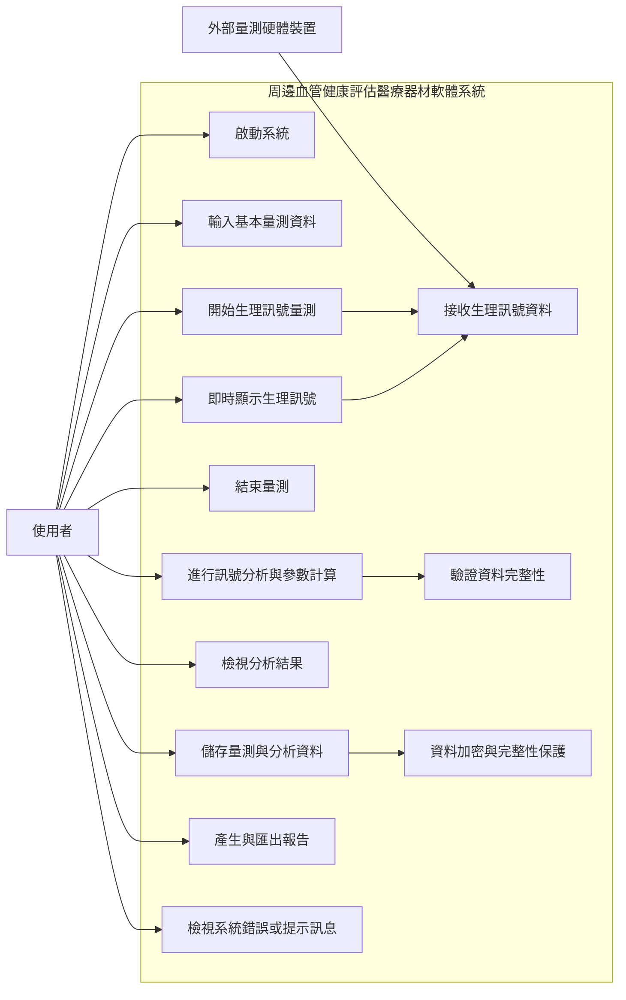

```mermaid
flowchart LR

%% Actors
User[使用者]
Device[外部量測硬體裝置]

%% System boundary
subgraph 系統[周邊血管健康評估醫療器材軟體系統]

  UC1[啟動系統]
  UC2[輸入基本量測資料]
  UC3[開始生理訊號量測]
  UC4[即時顯示生理訊號]
  UC5[結束量測]
  UC6[進行訊號分析與參數計算]
  UC7[檢視分析結果]
  UC8[儲存量測與分析資料]
  UC9[產生與匯出報告]
  UC10[檢視系統錯誤或提示訊息]

  UC11[接收生理訊號資料]
  UC12[驗證資料完整性]
  UC13[資料加密與完整性保護]

end

%% Actor interactions
User --> UC1
User --> UC2
User --> UC3
User --> UC4
User --> UC5
User --> UC6
User --> UC7
User --> UC8
User --> UC9
User --> UC10

Device --> UC11

%% Include relationships
UC3 --> UC11
UC4 --> UC11
UC6 --> UC12
UC8 --> UC13

```
